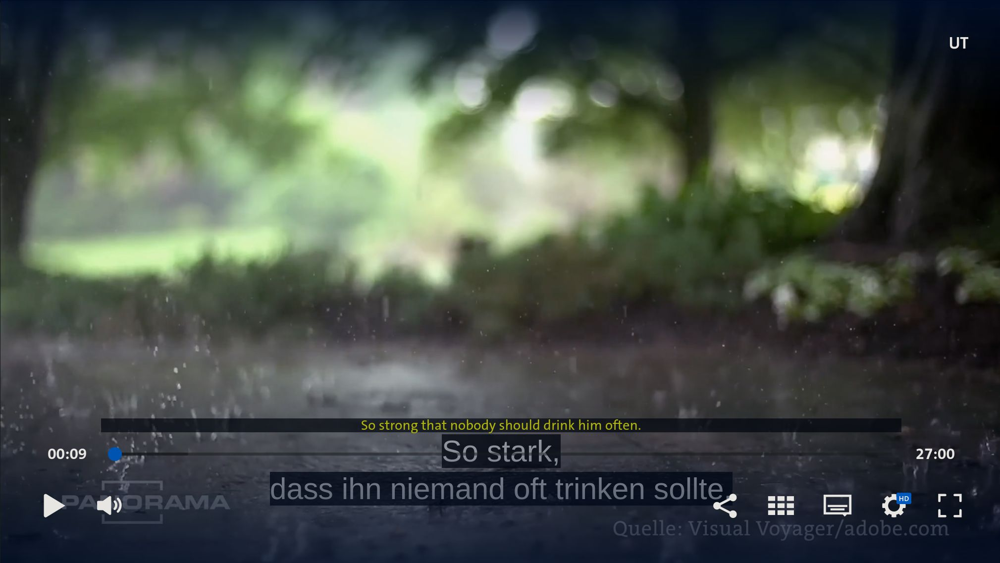

# ARD Mediathek Subtitle Translator

This Firefox extension translates subtitles on ARD Mediathek videos from German to English and displays them above the original subtitles when the video is paused.

## Features
- Automatically detects and translates subtitles in ARD Mediathek videos.
- Ensures subtitles are in German (`lang="de-DE"`) before translation.
- Stores translations to avoid redundant API calls.
- Displays translated subtitles only when the video is paused.
- Positions translated subtitles above the original ones.

## Installation
1. Download the extension files.
2. Open Firefox and go to `about:debugging`.
3. Click on `This Firefox` (or `This Nightly` if using Firefox Nightly).
4. Click on `Load Temporary Add-on` and select the `manifest.json` file.

## Usage
1. Open an ARD Mediathek video (`https://www.ardmediathek.de/video/*`).
2. Play the video, and subtitles will appear as usual.
3. Pause the video to see the translated subtitles appear above the original ones.

## Technical Details
- Uses the Google Translate API to translate subtitles.
- Monitors subtitle changes using a `MutationObserver`.
- Stores translations in a cache to prevent repeated API requests.
- Observes the play/pause button state to determine when to display translations.

## Future Enhancements
- Option to choose different target languages.
- Persistent storage for translations across page reloads.
- Customizable subtitle positioning and styling.

## License
This project is licensed under the MIT License.

